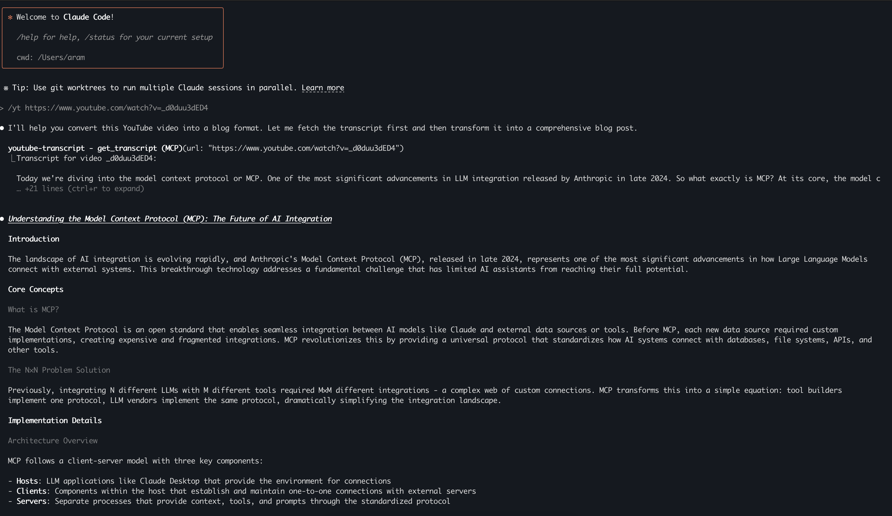

# YouTube Transcript MCP Server

A simple MCP (Model Context Protocol) server that fetches YouTube video transcripts.

## Features

- Extract transcripts from YouTube videos
- Support for multiple languages
- Works with various YouTube URL formats

## Installation

Requires Python 3.10 or higher.

```bash
# Install dependencies
pip install mcp>=1.12.4 youtube-transcript-api>=1.2.2
```

**Tested with:**
- Python 3.11
- mcp 1.14.0
- youtube-transcript-api 1.2.2

### Installation Options

**Option 1: Quick Install (minimum versions)**
```bash
# Install/upgrade all dependencies to minimum required versions
pip install --upgrade "mcp>=1.12.4" "youtube-transcript-api>=1.2.2"
```

**Option 2: Locked Versions (recommended)**
```bash
# Install exact tested versions for guaranteed compatibility
pip install -r requirements.txt
```

**Option 3: Clean Environment**
```bash
# Create isolated environment with exact versions
python3 -m venv youtube-transcript-env
source youtube-transcript-env/bin/activate  # On Windows: youtube-transcript-env\Scripts\activate
pip install -r requirements.txt
```

## Usage

### Claude Code

Add to `.claude.json` in your project:

```json
{
  "mcpServers": {
    "youtube-transcript": {
      "command": "python3.11",
      "args": ["/absolute/path/to/youtube-transcript-mcp-py/main.py"]
    }
  }
}
```

### Available Tools

#### `get_transcript`
Fetches the transcript of a YouTube video.

**Parameters:**
- `url` (required): YouTube video URL
- `languages` (optional): Array of preferred language codes (e.g., `["en", "th"]`)

**Example:**
```json
{
  "url": "https://www.youtube.com/watch?v=VIDEO_ID",
  "languages": ["en"]
}
```

## Tips & Tricks

### Custom Command Example

You can create a custom command that uses this MCP server. Add to your `CLAUDE.md`:

```markdown
#### Custom Commands
### yt - YouTube Blog Converter
Custom command to convert YouTube videos into blog format with maximum 5-minute read time:
1. Use mcp__YouTube__get_transcript tool to fetch transcript from provided URL
2. Transform content into professional blog format optimized for 3-minute read (approximately 600-750 words)
3. Structure as comprehensive blog with clear sections and subheadings
4. Focus on technical insights, implementation details, and practical applications
5. Format with structured sections:
   - **Introduction** (hook and context setting)
   - **Core Concepts** (main technical topics covered)
   - **Implementation Details** (how-to information, code examples, best practices)
   - **Key Insights** (important takeaways and lessons learned)
   - **Practical Applications** (real-world usage and examples)
   - **Bottom Line** (concise summary and final thoughts - REQUIRED section)
6. Use professional writing style with clear explanations and smooth transitions
7. Include relevant technical terminology and maintain accuracy while ensuring accessibility
8. Optimize reading flow with proper paragraph breaks and logical content organization
9. Automatically detect video language and write summary in same language for maximum effectiveness:
   - Thai videos → Thai summaries (preserves technical terminology, cultural context, serves target audience)
   - English videos → English summaries
   - Other languages → English summaries
```

Then use: `yt https://www.youtube.com/watch?v=VIDEO_ID`

**Example result:**




## Supported URL Formats

- `https://www.youtube.com/watch?v=VIDEO_ID`
- `https://youtu.be/VIDEO_ID`
- `https://www.youtube.com/embed/VIDEO_ID`
- `https://www.youtube.com/v/VIDEO_ID`

## Troubleshooting

### MCP Server Shows "Status: ✘ failed"

**Common causes and solutions:**

1. **MCP Version Too Old**
   ```bash
   # Check current version
   pip show mcp

   # Upgrade if below 1.12.4
   pip install --upgrade "mcp>=1.12.4"
   ```

2. **YouTube Transcript API Version Issues**
   ```bash
   # Upgrade to latest compatible version
   pip install --upgrade "youtube-transcript-api>=1.2.2"
   ```

3. **Build Configuration Missing**
   - Ensure `pyproject.toml` has the hatch build configuration:
   ```toml
   [tool.hatch.build.targets.wheel]
   packages = ["."]
   ```

4. **Python Version**
   - Requires Python 3.10 or higher
   - Test with: `python3 --version`

### MCP Server Starts But Transcript Fails

**"no element found: line 1, column 0" Error:**
- Video has no captions/transcripts available
- Video is private, unlisted, or region-restricted
- YouTube anti-bot measures (try again later)
- Check if video shows "CC" button in YouTube player

**"Could not extract video ID" Error:**
- Ensure URL format is supported (see above)
- Remove extra parameters like `&t=14s` if causing issues

### Connection Issues

**After updating dependencies, MCP server still fails:**
1. Completely restart Claude Code
2. Reconnect with `/mcp` command
3. Clear any cached configurations

**Dependency conflicts:**
```bash
# Check for conflicts
pip check

# If conflicts exist, create clean environment
python3 -m venv youtube-transcript-env
source youtube-transcript-env/bin/activate
pip install "mcp>=1.12.4" "youtube-transcript-api>=1.2.2"
```

### Testing Your Installation

**Test MCP server directly:**
```bash
cd /path/to/youtube-transcript-mcp
echo '{"jsonrpc":"2.0","id":1,"method":"initialize","params":{"protocolVersion":"2024-11-05","capabilities":{"roots":{"listChanged":true},"sampling":{}},"clientInfo":{"name":"test","version":"1.0"}}}' | python3 main.py
```

Should return: `{"jsonrpc":"2.0","id":1,"result":{"protocolVersion":"2024-11-05",...}}`

**Test YouTube API directly:**
```bash
python3 -c "
from youtube_transcript_api import YouTubeTranscriptApi
api = YouTubeTranscriptApi()
print('API working:', bool(api.list('dQw4w9WgXcQ')))
"
```

## License

MIT